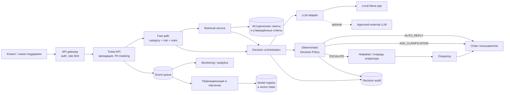

# Целевая архитектура

## Границы решения

Текущий PoC — синхронное FastAPI-приложение: модели sklearn и TF-IDF-индекс загружаются из файлов, mock или локальный llama.cpp вызывается по HTTP, результат возвращается без БД и очереди. Целевая архитектура ниже показывает развитие этого контура для пилота и production, но очередь, БД, helpdesk-интеграция и отдельные model services сейчас не реализованы.

## Компоненты и поток данных

Порядок обработки одного тикета:

1. Канал поддержки передаёт тикет и доступную историю в Ticket API.
2. API валидирует схему, нормализует текст и маскирует PII.
3. Быстрый путь предсказывает категорию и proxy-риск; чувствительные паттерны могут только повысить риск.
4. Retrieval находит похожие закрытые тикеты и утверждённые ответы.
5. LLM оценивает достаточность данных и готовит ответ, уточнение или резюме оператору.
6. Детерминированная Decision Policy проверяет риск, confidence, similarity и allowlist.
7. Пользователь получает ответ/уточнение либо helpdesk получает структурированный тикет.
8. Факты решения, latency и последующий результат публикуются для аудита и мониторинга.

## Синхронные и асинхронные части

Синхронный путь ограничен операциями, необходимыми для первого решения: валидация, классификация, risk rules, retrieval, опциональный вызов LLM и policy. Для high-risk или недоступного LLM ответ не должен ждать длительного восстановления: создаётся эскалация.

Асинхронно выполняются запись аналитических событий, уведомления оператору, обогащение тикета, переиндексация знаний, обучение/валидация моделей и расчёт отложенных бизнес-метрик. Очередь изолирует пользовательский SLA от медленных интеграций и пиков нагрузки.

## Хранилища и интеграции

- Helpdesk — источник статусов, ответов операторов, reopen и SLA; в PoC отсутствует.
- Audit store — неизменяемые версии признаков, моделей, policy и результата без скрытых рассуждений LLM.
- Историческое хранилище — очищенные тикеты и утверждённые ответы с контролем доступа.
- Model registry и vector index — версионированные модели/индексы с возможностью rollback.
- Внешний LLM допустим только как отдельная одобренная интеграция после PII-фильтрации; локальный llama.cpp является предпочтительным безопасным контуром PoC.

## Human-in-the-loop и fallback

High-risk тикеты нельзя закрывать автоматически: LLM может подготовить уточнение и operator summary, но итоговый процесс заканчивается у оператора. Medium-risk по умолчанию также эскалируется; автоматизация возможна только для явно утверждённых сценариев. При timeout, HTTP-ошибке, невалидном JSON, низкой уверенности или недостаточном retrieval система выбирает конкретный уточняющий вопрос либо `ESCALATE`. Kill switch должен позволять независимо отключить auto-reply, LLM или отдельную категорию без остановки приёма тикетов.

